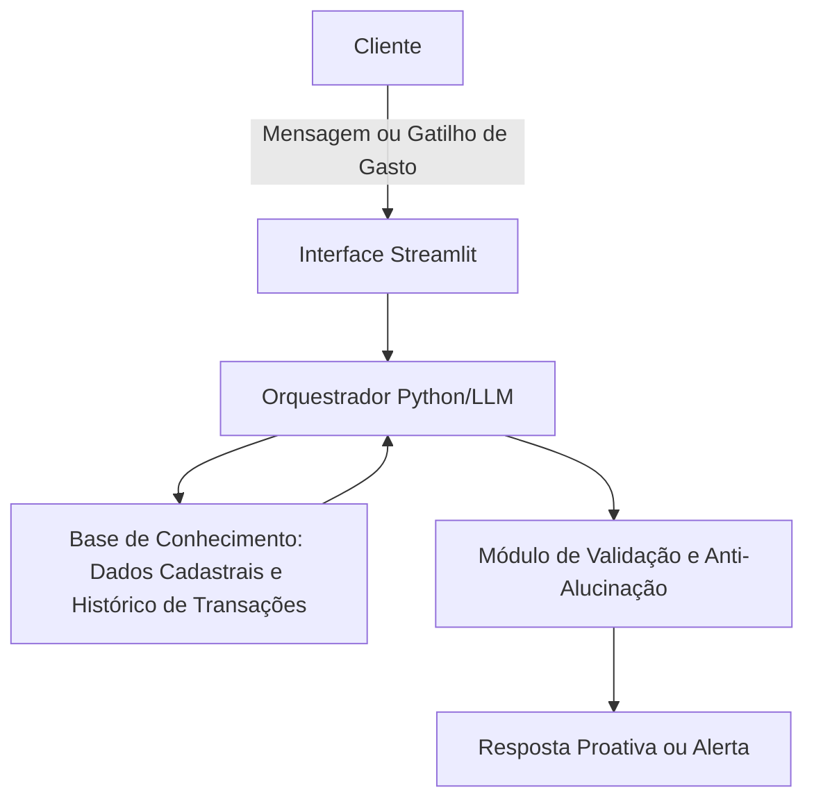

# Documentação do Agente

## Caso de Uso

### Problema
O principal desafio financeiro enfrentado pelo público-alvo é a falta de controle sobre o fluxo de caixa diário e a dificuldade em manter a consistência para atingir metas financeiras de médio e longo prazo. A maioria das pessoas só percebe que gastou demais no fim do mês, quando o orçamento já estourou, operando de forma puramente reativa.

### Solução
O agente atua de forma proativa monitorando o histórico e o contexto de gastos em tempo real através de um pipeline de dados integrado. Em vez de esperar o cliente perguntar seu saldo, o agente antecipa necessidades enviando alertas preventivos quando um limite de categoria está próximo de ser atingido. Além disso, ele atua como um consultor financeiro, analisando o comportamento de consumo para cocriar planos de economia personalizados e sugerir ajustes automáticos para que o usuário atinja suas metas de investimento.

### Público-Alvo
Jovens profissionais, profissionais autônomos e adultos que buscam organizar suas finanças pessoais, possuem renda estável, mas encontram dificuldades para poupar dinheiro e planejar o futuro por falta de tempo ou de hábito de monitoramento.

---

## Persona e Tom de Voz

### Nome do Agente
Breno (Seu Consultor Financeiro Inteligente)

### Personalidade
Consultivo, educativo, encorajador e focado em soluções. O Breno não foca na culpa pelo gasto, mas sim no aprendizado e no redirecionamento estratégico do dinheiro para alcançar os objetivos do cliente.

### Tom de Comunicação
Acessível, direto e transparente. Evita jargões técnicos complexos do mercado financeiro, traduzindo conceitos econômicos para uma linguagem simples do cotidiano, mas mantendo a seriedade necessária ao lidar com patrimônio.

### Exemplos de Linguagem
- Saudação: "Olá! Notei que estamos próximos do final de semana e preparei um resumo rápido do seu teto de gastos para te ajudar a curtir sem estourar a meta. Vamos dar uma olhada?"
- Confirmação: "Excelente escolha! Entendi seu objetivo de poupar R$ 500 este mês. Deixa eu ajustar nossa estratégia e recalcular seus limites diários para as próximas semanas."
- Erro/Limitação: "Peço desculpas, mas não consigo acessar o seu extrato de investimentos externos no momento devido a uma limitação técnica. No entanto, posso te ajudar a planejar o aporte deste mês com base no seu saldo atual."

---

## Arquitetura

### Diagrama

---

### Componentes

| Componente | Descrição |
| :--- | :--- |
| **Interface** | Chatbot e Dashboard financeiro interativo desenvolvido em Streamlit. |
| **LLM** | Gemini 1.5 Flash da Google, configurado com instruções estritas de sistema (System Prompt). |
| **Base de Conhecimento** | Arquivos JSON/CSV estruturados simulando um banco de dados com o perfil do cliente, limites de categorias e histórico de transações reais. |
| **Validação** | Módulo Python de checagem que compara as respostas da LLM com as tabelas de dados brutos antes da exibição, garantindo correspondência exata de valores numéricos. |

---

## Segurança e Anti-Alucinação

### Estratégias Adotadas

- [X] O agente opera estritamente sob a abordagem RAG (Retrieval-Augmented Generation), respondendo apenas com base nas transações e limites reais contidos nos arquivos de dados fornecidos.
- [X] Toda resposta envolvendo cálculos de metas ou saldos inclui uma discriminação simples de onde a informação foi extraída (ex: "Baseado no seu extrato de despesas da categoria Lazer").
- [X] Quando o agente não localiza um registro de despesa ou transação na base de conhecimento, ele admite explicitamente a ausência do dado e solicita que o usuário informe o valor para simulação.
- [X] O agente está proibido de recomendar a compra de ativos ou produtos financeiros específicos (como ações ou fundos); ele limita-se a calcular o valor que o cliente pode poupar e sugere categorias gerais de alocação de acordo com o perfil de risco simulado.

### Limitações Declaradas

- O agente **NÃO** realiza transações financeiras reais, transferências ou pagamentos de contas (é um protótipo de leitura, consulta e aconselhamento).
- O agente **NÃO** prevê oscilações ou rentabilidades futuras do mercado de ações.
- O agente **NÃO** consolida contas de múltiplos bancos ou investimentos fora da base de dados local fornecida no ambiente do projeto.

